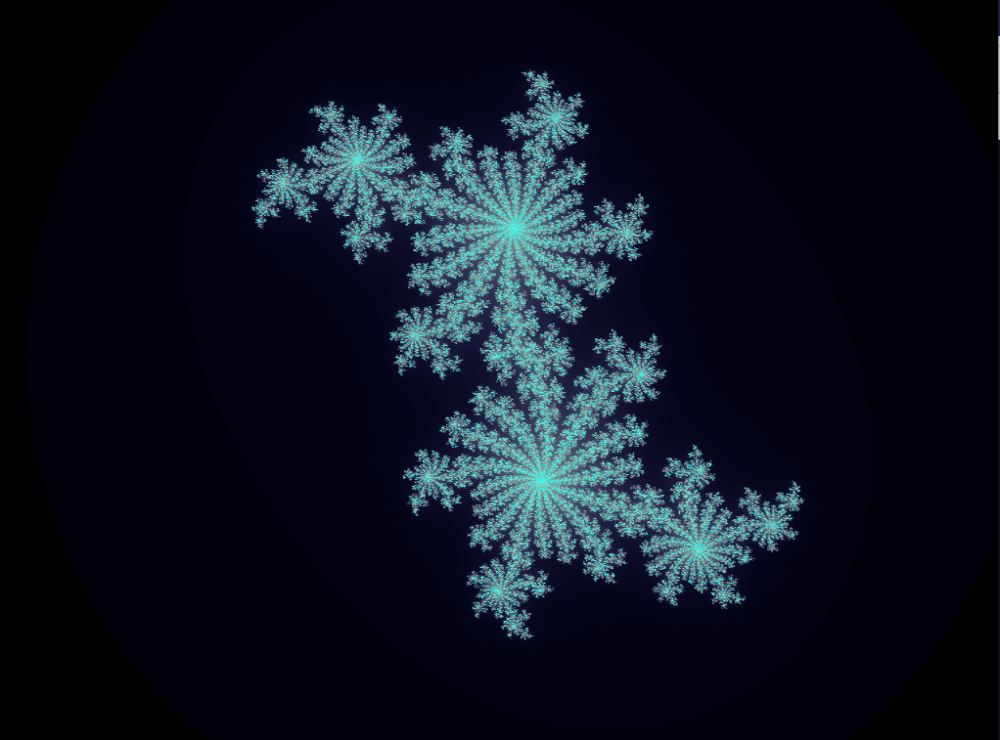

# JuliaSet

- C++ Program to draw simple julia set via OpenGL(GLFW)

# Requirement

### Ubuntu 22.04

- `sudo apt-get install libglfw3 libglfw3-dev libglm-dev libglew2.2 libglew-dev`

# Usage

- Clone the Repo
  - `git clone https://github.com/keitayoneda/JuliaSet.git`
- Build program

  - `cd build && cmake ..`
  - `make `

- execute program

  - `./cpu` or `./gpu`

- a window will be opened and julia set would be shown

  - 

# What is Shown On the Screen?

- [Wikipedia-JuliaSet](https://en.wikipedia.org/wiki/Julia_set#:~:text=The%20definition%20of%20Julia%20and%20Fatou%20sets%20easily,the%20study%20of%20dynamics%20in%20several%20complex%20variables.)

- Each pixel $(x, y) \in \mathbb{R}^2$ denotes Complex Number $z=x+yi$
- If the recurrence $z_{n+1} = z_n^2+c, \ z_0 = z$ does not diverge, $z$ is included in Julia Set $J(f), \ f(z)=z^2+c$
- You can change Constant $c \in \mathbb{C}$ by mouse left button
